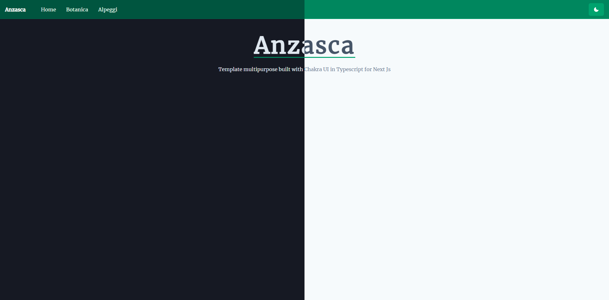

This is an [Next.js](https://nextjs.org/) project bootstrapped with [`create-next-app`](https://github.com/vercel/next.js/tree/canary/packages/create-next-app) `Typescript` and [Chakra UI](https://chakra-ui.com) implementation.

## added function
- navbar called `TopNav` responsive with `Drawer` component
- switch light/dark mode button based on `localStorage()`
- `Seo` component

